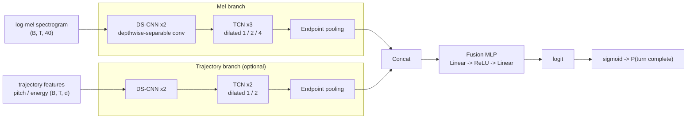
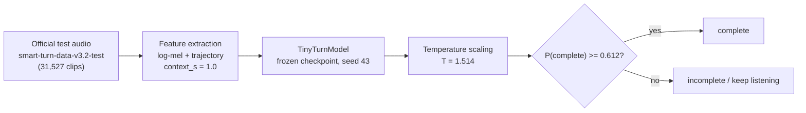

# TinyTurn

TinyTurn is a lightweight end-of-turn (turn-completion) detection model for voice agents: given
the last second or so of a speaker's audio, it predicts whether the speaker has actually finished
their conversational turn or is just mid-pause. TinyTurn is trained and
evaluated against pipecat-ai's `smart-turn-data-v3.2` dataset on Hugging Face.

The model (`TinyTurnModel` in [tinyturn/models.py](tinyturn/models.py)) fuses two small branches —
a log-mel DS-CNN+TCN encoder and an optional pitch/energy "trajectory" encoder — through endpoint-
aware pooling and a small fusion MLP, aiming for a model that's cheap enough to run in a real-time
voice pipeline.

## Architecture



Both branches share the same shape (`BranchEncoder` in [tinyturn/models.py](tinyturn/models.py)):
a couple of depthwise-separable conv blocks, a small dilated TCN stack, then endpoint-aware pooling
(`EndpointPooling` in [tinyturn/pooling.py](tinyturn/pooling.py)) that gives the model a sharper
view of the audio right around the point where the speaker stopped talking. `use_trajectory=False`
is the mel-only variant; the officially-evaluated finalist uses both branches.

## Official result

The finalist checkpoint (`data_scale_64k_holdloss0.5_5050sampling_seed43`: 1s context, controlled 50:50 real/synthetic
sampling, hold-loss λ=0.5, seed 43) was evaluated exactly once against the official 31,527-clip
`smart-turn-data-v3.2-test` set, at temperature-scaled threshold 0.612 (T=1.514):



| Metric | Overall | Real audio only |
|---|---|---|
| AUC | 0.861 | 0.781 |
| F1 | 0.598 | 0.195 |
| Precision | 0.862 | 0.831 |
| Recall | 0.458 | 0.111 |
| False-completion rate (FCR) | 0.073 | 0.022 |

Full breakdown (per-language, per-source, calibration, confidence intervals) is in
[experiments/official_test_report.json](experiments/official_test_report.json); per-clip
predictions are in `experiments/official_test_per_clip_results.parquet`. The full methodology,
ablations, and reasoning behind the finalist selection are written up in
[docs/RESULTS.md](docs/RESULTS.md). For every experiment that led up to it — architecture
selection, context-length probing, the pause-event/hold-loss objective, data scaling, distillation,
and ranking — see [docs/EXPERIMENTS.md](docs/EXPERIMENTS.md). For the exploratory data analysis
behind several of those decisions (dataset composition, label semantics, feature usefulness, context
window, and more), see [docs/EDA.md](docs/EDA.md).

The frozen checkpoint, its config/metrics, and an exported ONNX model (plus an int8-quantized
variant) live under
[experiments/data_scale_64k_holdloss0.5_5050sampling_seed43/](experiments/data_scale_64k_holdloss0.5_5050sampling_seed43/).

## Repo layout

- `tinyturn/` — the core package: dataset/feature loading, boundary estimation, model
  definitions, training loops (incl. distillation and pairwise-ranking variants), evaluation, and
  ONNX export.
- `scripts/` — the runnable experiment/evaluation scripts built on top of `tinyturn/`, including
  `run_official_test_evaluation.py`, the script that produced the official result above.
- `tests/` — unit tests for the `tinyturn` package.
- `experiments/` — a `config.json`/`metrics.json` (or nearest equivalent) for every experiment run
  in the project, the official-result artifacts, and the audits that gated the finalist choice
  (matched-recall audit, VAD boundary diagnostic, padding counterfactual, temperature scaling,
  ground-truth-conditioned metric audit).
- `eda_outputs/` — the plots and result tables behind the exploratory data analysis: dataset
  composition/bias checks, DSP feature usefulness, context-window findings, and more (see
  [docs/EDA.md](docs/EDA.md)).
- `docs/` — [EXPERIMENTS.md](docs/EXPERIMENTS.md), the full chronological experiment log;
  [RESULTS.md](docs/RESULTS.md), the deep dive on the final phase; and [EDA.md](docs/EDA.md), the
  exploratory data analysis that motivated several of the modeling decisions along the way.

This is a curated subset of a larger research project: every experiment's results are here, but
per-experiment checkpoints (other than the finalist's), exploratory notebooks, and raw training
logs are not.

## Setup

```bash
pip install -r requirements-part3.txt
```

`requirements-part3.txt` layers `resemblyzer` and `silero-vad` on top of an existing PyTorch/
audio-processing environment (torch, torchaudio, soundfile, pandas, etc.) — it is not a complete
environment spec on its own.

## Running things

Run the unit tests:

```bash
pytest tests/
```

Reproduce the official evaluation (requires the frozen checkpoint under `experiments/` and network
access to download the official test set from Hugging Face):

```bash
python scripts/run_official_test_evaluation.py --phase fetch_features
python scripts/run_official_test_evaluation.py --phase infer
python scripts/run_official_test_evaluation.py --phase report
```
