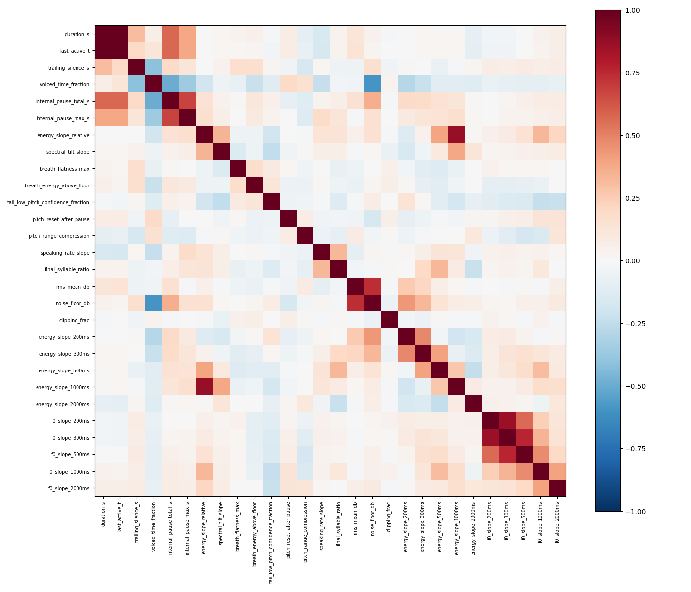
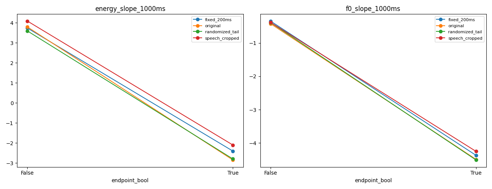
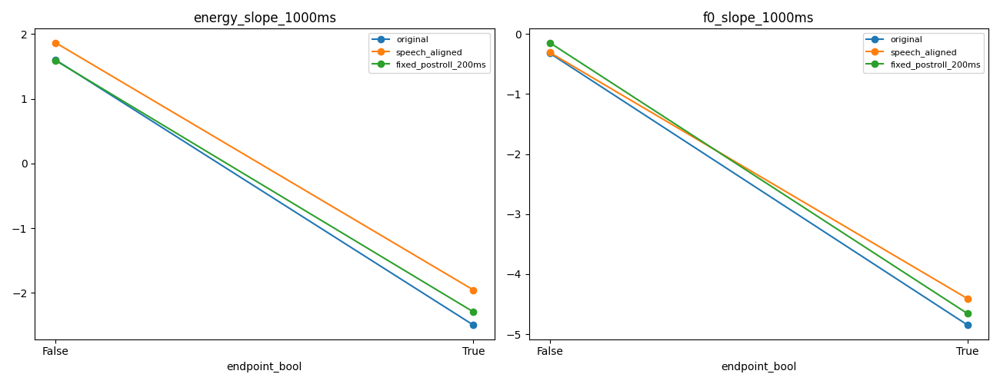
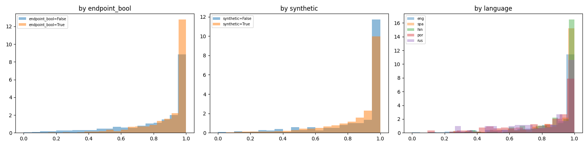
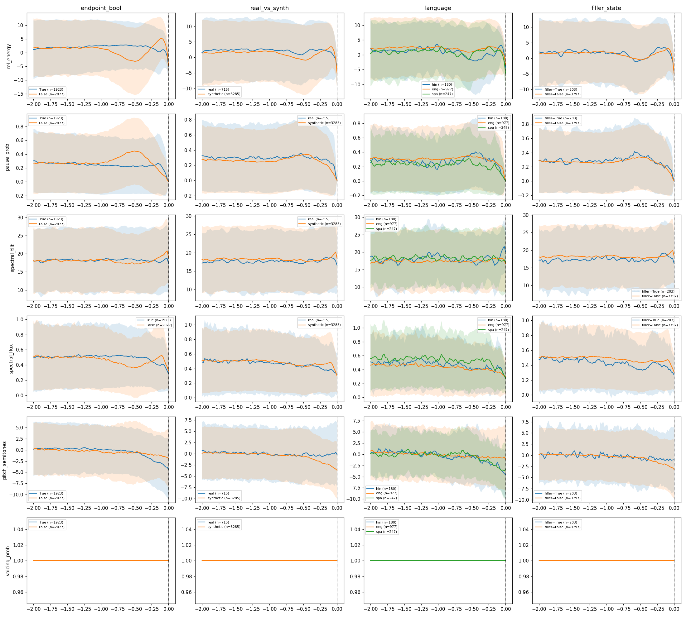
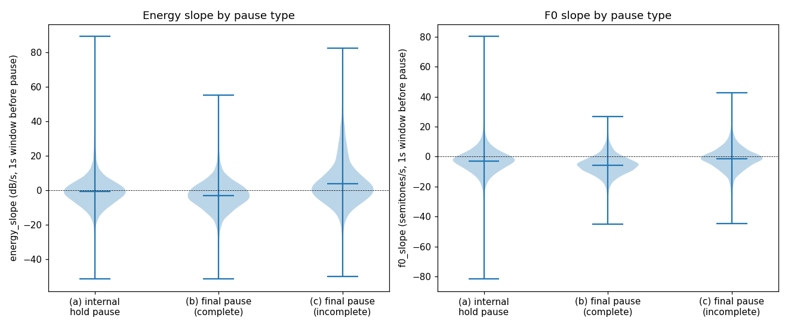

# TinyTurn — EDA Findings

This document catalogs the exploratory data analysis (EDA) that preceded all modeling work in
TinyTurn, run against [`pipecat-ai/smart-turn-data-v3.2-train`](https://huggingface.co/datasets/pipecat-ai/smart-turn-data-v3.2-train)
(270,946 rows, 83 parquet shards) and cross-checked against the held-out
`pipecat-ai/smart-turn-data-v3.2-test` set (31,527 rows) for leakage. It exists so a reader can see
*why* the modeling choices in [`docs/EXPERIMENTS.md`](EXPERIMENTS.md) look the way they do — every
data-side question that was asked before a single model was trained, and the actual evidence behind
each answer.

The analysis ran at several sample scales, reused throughout the tables below:

| Sample | n | How it was built |
|---|---|---|
| Full metadata scan | 270,946 rows | Every column except audio, streamed across all 83 shards, no decoding |
| 3,000-clip signal/DSP sample | 3,000 | First-streamed convenience sample (not stratified); used for most Section C-equivalent DSP work |
| Stratified sample ("D2") | 15,998 | IDs proposed by a stratified design, then fully decoded, feature-extracted, and transcribed |
| ASR sample | 400 | Transcribed via OpenAI `gpt-4o-transcribe`, Hindi-oversampled by design |
| ASR holdout (independent validation) | 1,035 | Two freshly-fetched shards, disjoint from the 15,998-row sample |
| Train/test independence check | 3,000 vs. 31,527 | Every row of the official test set compared against the 3,000-clip train-side sample |

Every number below traces to a table in `eda_outputs/tables/*.csv` or a plot in
`eda_outputs/plots/*.png`, both cited inline — nothing below is invented. Internal step-codes (A1,
B2, C3, D4, E5, …) are kept in parentheses purely so this document can be cross-referenced against
the project's own internal history; they are not the organizing structure. Where a finding directly
shaped a modeling decision, the relevant section of `docs/EXPERIMENTS.md` is linked.

---

## 1. Dataset scale, composition, and bias checks

The first question was whether the working samples used throughout the project (a 3,000-clip
convenience sample, later a 15,998-row stratified sample) were representative of the full
270,946-row population, or whether they'd quietly baked in a selection bias.

**Full-scan null/missingness** (`eda_outputs/tables/b1_null_report.csv`, B1): only `midfiller` and
`endfiller` have any nulls — 55,881 rows each (20.62%), concentrated in real (non-synthetic)
recordings, which were never scripted with a filler flag. Every other metadata column (`language`,
`endpoint_bool`, `synthetic`, `dataset`, `shard`) is fully populated.

**First-10-shards sample vs. the full 270,946-row scan**: the maximum absolute marginal difference
on any checked column (`language`, `dataset`, `endpoint_bool`, `synthetic`) was 0.38 percentage
points, with Jensen–Shannon divergence near zero on every column (max 0.0088, on `language`). The
original working sample was not meaningfully biased — though this held by luck, not by any
stratification design at the time.

**Stratified 15,998-id proposal vs. full population vs. the (then-current) 3,000-clip sample**
(`eda_outputs/tables/b2_stratified_vs_full_vs_current.csv`, B2): marginals on `language`, `synthetic`,
and `dataset` all land within roughly 1 percentage point of the full population for the stratified
proposal (e.g. English 24.29% full vs. 24.29% stratified vs. 24.80% in the 3k sample; synthetic
82.43% vs. 82.42% vs. 82.47%). This is the composition check that later data-scaling work in
`docs/EXPERIMENTS.md` re-used directly: when the 32k/64k training-data tiers were built by fetching
whole additional parquet shards, five (then eleven) newly-fetched shards were each checked against
this same population-level composition before being trusted, landing within ~1–3pp on every column
(see `docs/RESULTS.md`, Section 6/6b).

**Label balance holds at every level examined.** Full metadata: `{False: 136,641, True: 134,305}`
(50.4% / 49.6%). Per-language balance is close to 50/50 for every one of the 23 languages (e.g. `eng`
50.7%/49.3%, `hin` 50.7%/49.3%, `spa` 50.4%/49.6% — see the full `language × endpoint_bool` table in
`b1_language_x_endpoint.csv`), and likewise per-source (`b1_source_x_endpoint.csv`).

**Real audio is scarce and concentrated.** Real (`synthetic=False`) audio is 17.57% of the full
dataset (47,603 rows), confined almost entirely to English (91.6%) and Spanish (8.4%), sourced mostly
from `liva_1` (65.0%), `midcentury_1` (17.8%), and `mundo_1` (8.4%) (`a2_slice_profiles.csv`, A2). No
other language has *any* real-audio coverage. Hindi in particular is 12,006 rows (4.43% of the
dataset), confirmed **100% synthetic and 100% from a single source (`chirp3_1`)** at full-dataset
scale — there is no real spontaneous Hindi speech anywhere in this dataset, and since `language` only
carries a `hin` tag with no separate code-mixed/Hinglish label, nothing in this audit demonstrates or
refutes code-mixing. A model's performance on Hindi-tagged rows says nothing about Hinglish handling.

Every language/dataset/synthetic combination is heavily confounded by construction: 21 of 23
languages are produced by exactly one dataset source and are 100% synthetic
(`d3_confound_flags.csv`, D3 — `perfect_confound_language_dataset` and
`perfect_confound_language_synthetic` each fire for 21 languages). Only English and Spanish mix real
and synthetic audio at all. This matters for every DSP-feature confound check in Section 3 below,
since `dataset`/`language`/`synthetic` cannot be disentangled from each other for 21 of 23 languages.

## 2. Label construction: what `endfiller`/`midfiller` actually encode

`endfiller` and `midfiller` are scripted flags (present only for synthetic rows) marking whether a
clip's script was constructed to end (or contain) a filler word. The key question: does `endfiller`
leak the label, and how "hard" is the genuinely implicit slice of the data?

**`endfiller=True` implies `incomplete` almost deterministically.** Across the full metadata
(`a3_conditional_probabilities_ci.csv`, A3):

| condition | n | P(incomplete) | Wilson 95% CI |
|---|---|---|---|
| `endfiller=True` | 72,052 | 100.00% | [99.99, 100.00] |
| `endfiller=False` | 143,013 | 25.41% | [25.18, 25.63] |
| `midfiller=True` | 112,195 | 51.91% | [51.62, 52.21] |
| `midfiller=False` | 102,870 | 48.74% | [48.44, 49.05] |

This holds at 100.00% within *every* synthetic source and *every* language checked (full cross-tabs
in `a1_endfiller_slices_summary.txt`, A1 — e.g. `chirp3_1`: 51,465/51,465 `endfiller=True` rows are
incomplete; English: 4,675/4,675). This is almost certainly a property of the label-generation
procedure itself, not evidence a model can learn from filler words alone — and it means `endfiller`
must never be fed to a model as an input feature, since it would let the model shortcut the task on
the synthetic slice specifically.

The consequence is that the genuinely hard evaluation slice is **`implicit_incomplete`**
(`endpoint_bool=False, endfiller=False`): 36,334 rows, 26.59% of all incomplete-labeled rows
(`a2_slice_profiles.csv`, A2). Any model evaluation in this project reports this slice separately from
the overall number for exactly this reason (see `docs/EXPERIMENTS.md`'s "implicit-incomplete FCR"
columns and `docs/RESULTS.md`'s slice breakdowns).

A manual-listening audit queue of 120 clip ids across 8 named slices was built for a qualitative
check (`a5_manual_audit_manifest.csv`, A5), but the actual listening review was never completed — all
label/notes columns are empty. No manual-audit conclusion exists from this project; it remains an
open task if this analysis is picked back up.

## 3. Signal-level (DSP) feature usefulness

With label construction understood, the next question was how much genuine acoustic signal a
lightweight, hand-computed feature set carries for the endpoint-detection task itself — and how much
of that signal is actually a synthetic-vs-real or silence-duration confound in disguise. This ran
mostly on the 3,000-clip convenience sample (Section "C"), then was reproduced on the larger
15,998-row stratified sample (D2) to check the ranking held up.

**Top acoustic features by direction-normalized AUC** (`eda_outputs/tables/c3_feature_usefulness_ranking.csv`,
C3, n=3,000; full 28-feature table in that CSV):

| feature | AUC (95% CI) | Cliff's δ | confound flag |
|---|---|---|---|
| `energy_slope_500ms` | 0.707 [0.686, 0.726] | −0.414 | No |
| `energy_slope_relative` | 0.688 [0.669, 0.705] | −0.376 | No |
| `f0_slope_1000ms` | 0.686 [0.667, 0.704] | −0.372 | No |
| `energy_slope_1000ms` | 0.656 [0.636, 0.675] | −0.312 | No |
| `speaking_rate_slope` | 0.652 [0.634, 0.672] | −0.305 | No |

("confound flag" = the feature predicts `synthetic` more strongly than it predicts `endpoint_bool`;
9 of 28 features are flagged, including `trailing_silence_s`, `f0_slope_200ms`,
`breath_flatness_max`, `pitch_range_compression`, `voiced_time_fraction`, `duration_s`,
`clipping_frac`, `last_active_t`, and `rms_mean_db` — mostly duration/silence-adjacent features, not
the top-ranked slope features above.) The feature correlation structure behind this ranking:

*(`c3_feature_correlation_heatmap.png`, C3 — the different-window energy/F0 slopes cluster tightly
with each other, as expected; `energy_slope_relative` correlates with `energy_slope_1000ms`, and the
duration-adjacent features (`duration_s`, `last_active_t`, `internal_pause_total_s`) form their own
cluster, distinct from the slope-feature cluster.)*

**Re-run at 15,998-row scale (D2)** reproduces this ranking closely (`d2_stratified_feature_ranking.csv`
and the delta table `d2_vs_3k_feature_ranking_comparison.csv`): `energy_slope_500ms` AUC 0.707→0.700,
`energy_slope_relative` 0.688→0.694, `f0_slope_1000ms` 0.686→0.680 — all deltas within ±0.034, no
feature flips its confound flag between the 3k and 15,998-row samples. The ranking is stable, not an
artifact of the smaller convenience sample.

**Does the top signal survive silence-duration normalization?** (`c1_silence_ablation_auc.csv`, C1 —
comparing `original` clips against variants with trailing silence cropped, fixed to 200ms, or
randomized):

| feature | original | speech_cropped | fixed_200ms | randomized_tail |
|---|---|---|---|---|
| `energy_slope_1000ms` | 0.651 | 0.640 | 0.643 | 0.648 |
| `f0_slope_1000ms` | 0.694 | 0.683 | 0.689 | 0.695 |

Both features' AUC survives silence-duration standardization almost unchanged (≤1.1pp drop) — the
signal is real tail prosody, not an artifact of variable trailing-silence length. A companion check
in Part 2 (labeled "Section E" there, distinct from Part 3's E1–E5) confirms the same pattern
against an alternative silence-handling convention:

`speech_aligned` and `fixed_postroll_200ms` conventions both track `original`'s AUC within ~1pp
(`e_silence_convention_auc.csv`) — the choice of trailing-silence convention doesn't materially change
how much signal these two features carry.

**Domain-specific AUC** (`c4_domain_specific_endpoint_auc.csv`, C4, `energy_slope_1000ms`, n=15,998
scale): synthetic-only 0.671, real-only 0.612, Hindi 0.608, English 0.621, `chirp3_1`-only 0.693,
`liva_1`-only 0.616. The feature carries real signal on real audio too, just less of it than on the
synthetic-heavy full set — a pattern any architecture claiming real-audio robustness should expect
and budget for.

**A lower-ranked feature worth a closer look**: `tail_low_pitch_confidence_fraction` (AUC 0.595, C3)
— the fraction of a clip's final region where the pitch tracker reports low confidence. Its
distribution by slice:

The distribution is heavily right-skewed toward 1.0 for both classes (most clips end in largely
unvoiced/silent audio), with `endpoint_bool=True` clips modestly more concentrated at the extreme —
consistent with completed utterances more often trailing into pure silence rather than a held,
still-voiced pause.

**Feature missingness is real and non-trivial.** F0-tracking features have the highest missingness:
`f0_slope_200ms` 27.10%, `pitch_reset_after_pause` 24.47%, `f0_slope_300ms` 22.97%
(`b6_feature_missingness.csv`, B6). Chi-square tests confirm missingness is significantly associated
with `endpoint_bool` (χ²=23.35, p<0.001), `synthetic` (χ²=122.66, p<0.001), `dataset` (χ²=164.64,
p<0.001), and `language` (χ²=183.61, p<0.001) — real audio has 2–3x the missingness rate of synthetic
audio at every window size (e.g. 1000ms: 31.75% missing for real vs. 12.29% for synthetic). This fed
directly into a standing project decision (D12): **never silently drop rows with missing f0
features** — since dropping disproportionately
removes real-audio evidence, the class the project can least afford to lose signal on — and give each
window size its own missingness indicator feature rather than one collapsed flag, since the direction
of the missingness-vs-label association is non-monotonic across window sizes (flips from
`False>True` at 200ms to `True>False` at 300–500ms and back at 1000ms+).

**Data-quality anomalies are rare.** Only 6 of 3,000 sampled clips were flagged for manual review
(clipping, DC offset, near-zero energy, duration outliers) — see `c5_audio_quality_anomaly_manifest.csv`
and the full per-clip scan in `c5_audio_quality_full.csv`. A separate check flagged 30 clips with
unusually long trailing silence (`c5_long_trailing_silence_outliers.csv`) for awareness, not removal.

**Forward link**: this feature-usefulness and silence-normalization analysis is the direct precursor
to `docs/EXPERIMENTS.md` Section 1's mel + pitch/energy "trajectory" branch (`B1_trajectory_fusion`),
which added +5.6pp real-audio AUC over the mel-only baseline — the trajectory branch is, in effect,
a learned generalization of the hand-picked slope features ranked here.

## 4. Context-window findings

How much trailing audio does a model actually need? Two separate probes addressed this, at different
sample scales, with a consistent conclusion.

**Univariate AUC by context window** (`c2_context_window_summary.csv`, C2, n=800, energy/F0 slope
recomputed fresh from raw audio truncated to the final 2/4/6/8s before the speech boundary):

| context (s) | energy_slope AUC | f0_slope AUC |
|---|---|---|
| 2.0 | 0.547 | 0.592 |
| 4.0 | 0.619 | 0.547 |
| 6.0 | 0.588 | 0.524 |
| 8.0 | 0.614 | 0.517 |

Neither feature shows a clean monotonic improvement with more context — energy_slope peaks at 4s,
f0_slope actually peaks at 2s and degrades with more context. Reproduced at n=5,000 (D2 scale,
`d2_stratified_context_window.csv`): same qualitative pattern (energy_slope 0.541→0.599→0.582→0.573;
f0_slope 0.596→0.538→0.526→0.511 across 2/4/6/8s) — not a small-sample artifact.

**A trained, multivariate probe tells a more decisive story** (`d6_context_probe_results.csv`, D6 —
fixed 5-fold-CV logistic regression on the same 8 hand-picked features, n=5,000, swept 1/2/4/6/8s):

| context length (s) | CV accuracy | AUC (95% CI) |
|---|---|---|
| 1 | 0.6964 | 0.7629 [0.7504, 0.7762] |
| 2 | 0.6778 | 0.7292 [0.7157, 0.7427] |
| 4 | 0.6704 | 0.7257 [0.7142, 0.7406] |
| 6 | 0.6672 | 0.7236 [0.7109, 0.7384] |
| 8 | 0.6672 | 0.7242 [0.7120, 0.7401] |

The trained probe's best accuracy and AUC are both at **1 second of context**, monotonically
*declining* as more context is added — the opposite of what a naive "more context can only help"
intuition would predict, and the opposite of the single-feature C2 sweep's shape at the shortest
window. **Forward link**: this same "does more context help a multivariate model" question is the
one `docs/EXPERIMENTS.md` Section 2 answers with an actual trained model — its Section 2a probe
(`C0_context_probe`) is built in this same lineage, and its Section 2b learned-model ablation
ultimately settles on `N=1.0s` for the tiny model (no accuracy evidence favors longer context) and
`N=4.0s` for the Whisper-based model, explicitly noting that the naive EDA-stage conclusion "did not
survive contact with an actual trained model."

## 5. Train/test independence, duplicate detection, and confound audits

Before any split-design decision could be trusted, two questions needed answering: is there any
leakage between train and the official test set, and are apparent within-train "duplicates"
actually real?

**Zero test/train overlap by exact waveform hash.** SHA-256 of the 16kHz/mono/int16-normalized
waveform, full official test set (31,527 rows) against the 3,000-clip train-side sample: 0 shared
hashes (`d1_overlap_summary_by_match_type.csv`, D1).

**A naive MFCC-cosine near-duplicate check was a false-positive artifact, not real overlap.** A fixed
0.995 cosine-similarity threshold on a 40-dimensional MFCC mean+std fingerprint flagged 83.02% of
test rows (26,173/31,527) as "near-duplicates" of some train clip — but a random unrelated
test/train pair already averages 0.966 cosine similarity on this fingerprint (max 0.998 over 20,000
random pairs), so with 31,527 queries against only 3,000 candidates, exceeding a fixed threshold by
chance alone is almost guaranteed, independent of any real duplication. A per-query z-score
correction (top-1 similarity vs. that query's own similarity distribution across all 3,000
candidates, requiring z≥8 AND raw similarity≥0.999) finds **zero** defensible matches — max z
observed was 3.95, nowhere near outlier territory.

The same correction was applied retroactively to an earlier within-train duplicate-detection claim
(`d1_b5_duplicate_detection_correction.csv`, D1): the original claim of 1,973 near-duplicate pairs
within the 3,000-clip train sample reproduces at 2,498 flagged pairs under the naive threshold, but
the z-score-corrected version finds **zero** (max z observed 2.557) — the original duplicate count
should not be used for any split-design decision as-is.

**Boundary-only features carry very little signal on their own** (`d9_boundary_leakage_results.csv`,
D9 — a probe restricted to terminal amplitude, sample discontinuity, zero-crossing proximity, and
short-window spectral content, computed only on the final 50/100/200ms of each clip): AUC rises from
0.526 (50ms) to 0.580 (200ms), only modestly above chance. There's no evidence of a boundary-only
shortcut that would let a model "cheat" using pure waveform-edge artifacts instead of genuine
prosody.

**The dataset's confound structure is severe and mostly unavoidable within the training data itself**
(D3, `d3_confound_flags.csv` / `d3_joint_support_table.csv`): of 3,312 possible
(language × dataset × synthetic × endpoint_bool × endfiller) combinations, only 90 have any support
at all, and 306 of the 348 flagged cells are simply zero-support. 21 of 23 languages are produced by
exactly one dataset source, 100% synthetic — meaning `language`, `dataset`, and `synthetic` cannot be
disentangled from each other for the great majority of the dataset's language coverage; only English
and Spanish provide any real/synthetic contrast at all.

## 6. ASR transcription, lexicon mining, and validation

Since `endfiller`/`midfiller` are null for all real-audio rows, an ASR-based approach was explored to
recover an equivalent signal from transcripts — and to validate/expand the filler-word lexicon used
to derive it.

**Original lexicon coverage was already good for its 3 supported languages, and near-useless
elsewhere** (`b4_asr_lexicon_classification_metrics.csv`, B4, 400-clip ASR sample): for
`lexicon_supported` (English/Hindi/Marathi only), precision 0.773 / recall 0.642 / balanced accuracy
0.778; for every other language (`lexicon_unsupported_exploratory`), recall was 0.000 — the lexicon
simply had no coverage there. This is lexicon-*development* data (the lexicon was iteratively fixed
while looking at these same 400 transcripts), not an unbiased validation set — a genuinely
independent check follows below.

**Mining new candidate filler words** from the synthetic subset of the 15,998-row transcript set
(13,186 synthetic clips, comparing per-language word frequency between `endfiller`/`midfiller` True
vs. False groups; full 613-candidate table in `d7_mined_filler_candidates.csv`, D7) surfaced strong,
near-deterministic candidates in every language — e.g. German "also"/"aber" (lift >1,300x), Hindi
"लेकिन" (lift 2,172x), Portuguese "mas" (lift 2,160x). After applying selection thresholds
(lift≥10 for endfiller candidates, lift≥3 for midfiller, lift≥50 for Chinese character-level
candidates), **213 new lexicon entries across 21 languages** were proposed
(`d7_proposed_lexicon_additions.csv`).

**A genuinely new limitation was found mid-analysis, not previously caught**: `endfiller_derived`
label derivation tokenizes transcripts by whitespace, but `gpt-4o-transcribe` returns Chinese and
Japanese without inter-word spaces — mean `n_words` for these two languages is 1.03 and 1.07 versus
10.3–22.9 for every other language. This structurally breaks whitespace-based filler detection for
Chinese and Japanese specifically (not just "lower recall," a different and more fundamental failure
mode). A character-n-gram workaround was used for lexicon mining only
(`d7_mined_filler_candidates_cjk_charlevel.csv`) — it works well for Chinese (clean connectives like
所以/"so", 但是/"but" at >280x lift) but is noisier for Japanese due to its agglutinative morphology.
Any downstream use of `endfiller_derived`/`midfiller_derived` for these two languages should be
treated as unreliable.

**Independent lexicon validation on a disjoint holdout** (`d8_asr_independent_validation.csv`, D8 —
1,035 fresh ids from 2 newly-fetched shards, evaluated on 995 synthetic rows with scripted `endfiller`
ground truth, using the original lexicon plus the 213 D7 additions): overall precision 0.727 / recall
0.593 / balanced accuracy 0.740 (n=995, 200 TP / 583 TN / 75 FP / 137 FN) — a substantial recall
improvement over the pre-expansion lexicon-supported-only numbers, now validated on data the lexicon
was never tuned against, and covering languages the original lexicon didn't touch at all (e.g. Hindi
recall 0.824, Finnish 0.882, though results vary widely by language — Ukrainian 0.455, Japanese and
Chinese both 0.000, consistent with the tokenization limitation above).

**Forward link**: `docs/RESULTS.md` Section 6 explicitly relies on this finding — the 32k/64k
data-scaling tiers were built *without* running any ASR transcription at all, because `endfiller`
ships natively in the raw HF metadata for synthetic rows (confirmed 100% null for real rows, the same
convention this section establishes), so nothing the standard training/evaluation loop needs was lost
by skipping transcription for the new shards.

## 7. Noise-bed fingerprinting and speaker/voice clustering

Two exploratory checks looked at whether background noise or synthetic voice identity could serve as
useful split-hygiene or confound-detection signals.

**Repeated background-noise fingerprinting** (`d10_noise_cluster_vs_label_source.csv`, D10 — 12
KMeans clusters on mel-spectrogram mean+std fingerprints of each clip's longest silent region, n=2,625
of 3,000 with a usable silent region ≥0.3s): cluster sizes range from 39 to 370, and `pct_endpoint_true`
per cluster ranges narrowly from 43.8% to 53.2% — no cluster shows a strong label skew, so
noise-bed identity does not appear to leak endpoint information on its own.

**Speaker/TTS-voice clustering** (D11, `resemblyzer` embeddings + agglomerative clustering,
n=3,000; underlying `d11_voice_clusters.parquet` was not committed to this repo's evidence set, so
these cluster-level numbers are not independently re-derivable from a file here and should be read
as reported rather than re-checked): a silhouette scan chose threshold=0.25 (k=266 clusters, silhouette 0.137 — a
weak separation at every threshold tried, 0.075–0.137). Mean dominant-dataset fraction across
clusters with n≥3 was 0.855, but mean dominant-*language* fraction was only 0.751, and the very
largest clusters (n=185, 161, 129...) had *low* language dominance (9–27%) despite moderate dataset
dominance (59–71%). **No actual listening validation was performed** (no audio playback capability in
that session) — this is a metadata-based proxy only. The working interpretation is a caution flag,
not a clean result: `resemblyzer` (built for human-speaker verification) may be picking up
per-dataset production/vocoder characteristics as strongly as individual TTS voice identity, so
`voice_cluster` should not be treated as a validated same-speaker split-hygiene key without a human
listening pass on the largest clusters first.

## 8. Terminal prosody, pause typology, and filler taxonomy

Part 3 of this EDA (Section "E" in the internal numbering, not to be confused with Part 2's
same-lettered silence-convention check in Section 3 above) focused specifically on
architecture-relevant questions: what does the acoustic trajectory look like right before a
completion vs. a pause, and does the filler-word taxonomy break down into sub-categories with
different predictive strength.

**Terminal prosody trajectories** (D5's plot output, feeding into E1's by-slice tables in
`e1_terminal_prosody_by_slice.csv`) plot six features over the final 2 seconds before the speech
boundary, sliced four ways:

The clearest separation is in `rel_energy` and `pitch_semitones`: completed (`True`) clips show a
late uptick in relative energy in the final ~0.2s while incomplete clips dip and hold; pitch
declines much more sharply for incomplete clips in the final ~0.5s across every slicing dimension
(`endpoint_bool`, `real_vs_synth`, `language`, `filler_state`) — the effect is consistent whether or
not a filler word is present, and whether the clip is real or synthetic. The by-slice numeric
version of this (E1, `e1_terminal_prosody_by_slice.csv`) confirms this holds even on the hardest,
most-restricted slice: `energy_slope_1000ms` mean difference (true − false) is −6.08 on all data
(Cliff's δ −0.31) and still −3.77 restricted to `implicit_incomplete_real_only` (Cliff's δ −0.21) —
attenuated on the harder real-audio-only implicit slice, but the same direction and still a
medium-sized effect, not noise.

**Internal-pause vs. final-pause comparison** (`e2_pause_type_comparison.csv` /
`e2_pause_type_comparison_real_only.csv`, E2 — comparing the acoustic window before an internal
hold-pause against the window before a final pause, split by whether that final pause preceded a
complete or incomplete utterance):

On the mixed sample (n=14,012, 84.1% synthetic): `energy_slope` mean is −0.57 before an internal
hold, vs. −2.85 before a final-complete pause and +3.85 before a final-incomplete pause (Cliff's δ,
internal-hold vs. final-incomplete: −0.21) — internal holds look acoustically distinct from both
kinds of final pause, not just a blend of the two. On the real-audio-only re-run (n=2,230), the same
ordering holds for `energy_slope` (−0.77 / −2.98 / +1.16) though effect sizes shrink, while
`f0_slope`'s ordering is much noisier on real audio alone (differences not clearly separated,
Cliff's δ magnitudes ≤0.05) — a reminder that F0-based effects seen on the mixed (mostly synthetic)
sample don't automatically transfer to real audio. **Forward link**: this internal-hold-vs-final-pause
distinction is the direct motivation for `docs/EXPERIMENTS.md` Section 5's pause-event training
objective (the "P1" family) — training the model to distinguish a genuine hold from a real ending is
exactly the acoustic contrast quantified here.

**Filler taxonomy sub-categories carry different predictive strength**
(`e3_filler_taxonomy_conditionals.csv`, E3, n=15,082, Chinese/Japanese excluded per the D7
tokenization limitation): P(incomplete | word present) ranges from 84.2% for `subordinate`
conjunction words (n=538 clips matched) down to 52.1% for `response_particle` words (n=612) — both
above the 50.2% baseline rate, but by very different margins. Collapsing all filler sub-categories
into one flag would discard this gradient.

## 9. Padding, silence conventions, and VAD-boundary robustness

The last cluster of EDA questions was about how a model's *input construction* — not the dataset
itself — could introduce shortcut-learning risk, and how sensitive downstream predictions are to
exactly where the speech boundary is drawn.

**The dataset is not pre-padded or pre-truncated.** Fetching the reference implementation's own
convention (`pipecat-ai/smart-turn/audio_utils.py`: truncate to the last 8s, left-zero-pad if
shorter) and measuring it directly against 3,000 raw clips (`d4_padding_boundary_stats.csv`, D4):
leading zero-run length is ~0ms for effectively every clip (mean 0.0014ms, max 0.875ms — noise
floor, not real padding; fraction of clips with >5ms leading zero-run: 0.0000), and shows no
correlation with duration (r=−0.01). **Any padding-boundary leakage risk would be introduced by
whichever training pipeline is built for this project, not by the raw data.** Clip start/end
boundaries are abrupt for roughly a quarter of clips (26.3% have non-trivial amplitude at the very
first sample, 26.6% at the very last) — a property of how clips were segmented from longer source
audio, producing a possible audible click at the boundary, not a padding artifact. This directly
informed the recommendation that a model reproducing the fixed-length left-zero-pad convention
should mask the padded region explicitly rather than feed raw zeros — since duration correlates
with `endpoint_bool`, language, and source, an unmasked model has every incentive to learn "padding
amount" as a shortcut. **Forward link**: `docs/EXPERIMENTS.md` Section 3 documents exactly this
class of bug being found and fixed at training time (the input contract was tightened to exactly
*N* seconds ending at the detected speech boundary, no baked-in post-roll; a frame-mask
misalignment was found to zero out the ~2 frames nearest the speech boundary on every A0 example).

**Padding-scheme counterfactual** (`e4_padding_counterfactual_results.csv`, E4 — one fixed
logistic-regression probe trained on 8s-context features applied to 4 padded/unpadded versions of
400 held-out short clips): mean predicted probability varies substantially by padding scheme alone
— `prob_left_zero` mean 0.634 vs. `prob_unpadded` mean 0.468, a swing of over 16 percentage points
from padding choice alone, holding the actual audio content fixed. 47.0% of clips show a
>0.20-probability swing across padding schemes (`max_abs_diff` mean 0.222). **Forward link**: this
is the EDA-stage precursor to `docs/EXPERIMENTS.md` Section 4's padding-counterfactual robustness
gate for the Whisper-based teacher model (8e) — the same class of test, run against an actual
trained model with a formal pass/fail bound instead of a single hand-built probe.

**VAD/boundary-estimator sensitivity** (`e5_vad_sensitivity_results.csv` / `e5_prediction_deltas.csv`,
E5, n=3,000 — comparing three speech-end estimators: A=fixed energy threshold, B=alternative
threshold parameterization, C=Silero VAD):

| estimator pair | mean Δt | median Δt | mean predicted-probability Δ | % clips with Δ>0.2 |
|---|---|---|---|---|
| A vs. B | 87.6ms | 20ms | 0.0409 | 4.9% |
| A vs. C (Silero) | 212.7ms | 170ms | 0.1257 | 20.6% |
| B vs. C (Silero) | 192.7ms | 170ms | 0.1197 | 18.9% |

Two different energy-threshold parameterizations (A/B) mostly agree (median 20ms apart, only 4.9%
of clips swing predicted probability by >0.2), but either one disagrees substantially with Silero
VAD's boundary placement (median 170ms apart, ~20% of clips swing by >0.2). **This is the direct EDA
precursor to `docs/EXPERIMENTS.md` Section 4's full VAD-boundary robustness gate** — which found,
against an actual trained Whisper-based model at full validation scale (n=1,600), a decisive-fail
flip rate of 10.5–12.3% against both an alternative threshold and Silero specifically, closely
consistent with the double-digit-percentage sensitivity already visible here at the exploratory
stage.

## 10. Conclusions that most directly shaped modeling decisions

1. **`endfiller` is a near-deterministic label-construction artifact for the synthetic subset (Section
   2) and must never be a model input; `implicit_incomplete` must be reported as its own evaluation
   slice.** This convention is used throughout `docs/EXPERIMENTS.md` and `docs/RESULTS.md`'s
   "implicit-incomplete FCR" metrics.
2. **Real-audio scarcity (17.6% of the dataset) and Hindi's 100%-synthetic, single-source coverage
   (Section 1) are structural gaps this dataset alone cannot close** — every real-audio AUC number
   in `docs/EXPERIMENTS.md` should be read with this scarcity in mind, and any Hinglish-handling
   claim needs data this project doesn't have.
3. **Hand-picked DSP tail-prosody features carry genuine, silence-normalization-robust signal
   (Section 3), and a trained multivariate context probe favored the shortest context length tried,
   1 second, over any longer window (Section 4).** Both directly motivated
   [`docs/EXPERIMENTS.md` Section 1](EXPERIMENTS.md#1-architecture-selection-b0--b1--b1-f0--a0-all-at-40s-context)'s
   trajectory-branch architecture and
   [Section 2](EXPERIMENTS.md#2-context-length-probing)'s context-length ablation — though Section 2
   also shows the EDA-stage context conclusion (favoring 4s) did not survive contact with an
   actual trained model, which is itself the more important lesson: EDA-stage handcrafted probes
   are directional, not a substitute for training the real thing.
4. **The dataset itself is not pre-padded (Section 9)** — any padding-boundary shortcut-learning
   risk is introduced by the training pipeline, not inherited from the data — which is exactly the
   class of bug [`docs/EXPERIMENTS.md` Section 3](EXPERIMENTS.md#3-input-contract-correction-and-convergence-checks)
   found and fixed (input contract tightened to exactly *N* seconds with no baked-in post-roll; a
   frame-mask misalignment zeroing the 2 frames nearest the speech boundary). The EDA-stage padding
   counterfactual (Section 9) and VAD-boundary sensitivity sweep (Section 9) are the direct,
   smaller-scale precursors of the formal padding-counterfactual and VAD-boundary robustness gates
   in [`docs/EXPERIMENTS.md` Section 4](EXPERIMENTS.md#4-teacher-qualification-track-is-a0-viable-as-a-distillation-teacher).
5. **No ASR transcription was needed for standard training/evaluation, because `endfiller` ships
   natively in the raw metadata for synthetic rows (Section 6)** — this let the 32k/64k
   data-scaling experiments in [`docs/RESULTS.md` Section 6](RESULTS.md) skip transcription
   entirely for newly-fetched shards, and the same section's shard-representativeness check reused
   this document's own full-population composition numbers (Section 1, B2) directly.

---

For the complete, unabridged numeric detail behind every table above, see the individual CSVs under
[`eda_outputs/tables/`](../eda_outputs/tables/) cited throughout — e.g. the full 28-feature DSP
ranking in `c3_feature_usefulness_ranking.csv`, the full endfiller cross-tabs in
`a1_endfiller_slices_summary.txt`, and the full mined-lexicon lists in `d7_mined_filler_candidates.csv`
and `d7_proposed_lexicon_additions.csv`.
